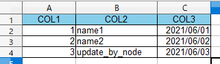
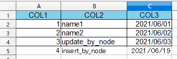

# TypeScriptでSQLを使いExcelファイルを更新するサンプル
ソースコード：
https://github.com/murasuke/ts-node-excel-sql
## 前書き

* Excelのシートをテーブル名、各シートの1行目を列名として`Select`,`Insert`,`Update`,~~Delete~~するサンプルです

  ⇒ Deleteはプロバイダがサポートしていないのでできませんでした。

* Windows限定です(ActiveX(ADO))を使うため

* TypeScript(ts-node)を使います(ADOの型定義があり、コーディングが楽なため)

* 最低限の動作確認をjavascriptで行い、TypeSciptで書き直します

## 実現方法

* ADO(ActiveX Data Object) + Microsoft.ACE.OLEDB.12.0 でExcelファイルを更新

* nodeでActiveXを利用するため[winax(COM object wrapper)](https://www.npmjs.com/package/winax)を使います

## javascriptで最低限の動作確認を行う
### 実行前の準備
* winaxをインストールします

```
npm i winax
```

* `sample-data.xlsx`という名前でExcelファイルを作り`Sheet1`に下記データをコピーします

|COL1|COL2|COL3|
|--|--|--|
|1|name1|2021/06/01|
|2|name2|2021/06/02|
|3|name3|2021/06/03|

### 最小限のサンプルソース(minimal-sample.js)

```typescript
//import path from 'path';
const path = require('path');
require('winax');

// Microsoft.ACE.OLEDBプロバイダでExcelを開く
const excelPath = path.join(__dirname, 'sample-data.xlsx');
const connString = `Provider=Microsoft.ACE.OLEDB.12.0;Data Source=${excelPath};Extended Properties="Excel 12.0 Xml;HDR=YES;"`;
const cn = new ActiveXObject('ADODB.Connection');
cn.Open(connString);

const cmd = new ActiveXObject('ADODB.Command');
cmd.ActiveConnection = cn;

// Updateで更新する
cmd.CommandText = `UPDATE [Sheet1$] SET COL2 = 'update_by_node' WHERE COL1 = 3`;
cmd.Execute();

// 更新されていることをSelectで確認
cmd.CommandText = `SELECT * FROM [Sheet1$] WHERE COL1 = 3`;
const rs = cmd.Execute();
console.log(rs.Fields('COL2').Value);

cn.Close();
```

### 動作確認

```
$ node minimal-sample.js
update_by_node
```

* Updateで更新した結果が取得できてることが確認できました

  


## TypeSciptに書き直し編

詳細は[ts-node-excel-sql](https://github.com/murasuke/ts-node-excel-sql)でご確認下さい

###  ts-nodeと型定義を読み込みます

```
npm i typescript @types/node @types/activex-adodb -D
npm i winax ts-node -D
```

* `sample-data-template.xlsx`という名前でExcelファイルを作り`Sheet1`に下記データをコピーします

|COL1|COL2|COL3|
|--|--|--|
|1|name1|2021/06/01|
|2|name2|2021/06/02|
|3|name3|2021/06/03|


###  下記ファイルを作成します(ts-excel-sql.ts)

```typescript
/**
 * node.jsでExcelファイルにSQLで更新するサンプル
 * ・`winax`(https://www.npmjs.com/package/winax)でADO(ActiveX Data Object)を利用します
 * ・「Microsoft.ACE.OLEDB」(旧Jetエンジン)プロバイダを利用して、クエリを実行します
 * ・「シート名」が「テーブル名」です。シート名の最後に'$'を追加し、[]で括ります
 * ・1行目が「列名」になります(HDR=YES)
 * ・Select, Insert, Updateが可能です。Deleteはプロバイダがサポートしていません
 */

import fs from 'fs';
import path from 'path';

require('winax');

// 何度も実行できるようにするため、テンプレートをコピーしたファイルに対して更新操作を行う
const xlsxTemplate = './sample-data-template.xlsx';
const xlsxTarget = './sample-data.xlsx';

// ファイルがあれば削除してから、テンプレートをコピー
if (fs.existsSync(xlsxTarget)) { fs.unlinkSync(xlsxTarget); }
fs.copyFileSync(xlsxTemplate, xlsxTarget);

// ADOでExcelに接続
const cn = connectExcel(path.join(__dirname, xlsxTarget));

// 変更前ファイルをSelect(3行)
const resultSet = selectExcel(cn, 'Sheet1');
showResultSet(resultSet);

// 3行目を更新、4行目をInsert
updateExcel(cn);
insertExcel(cn);
// deleteExcel(cn); //  OLE DB providerがdeleteをサポートしていないため実行不可

// 変更後データを表示する(4行)
const resultSet2 = selectExcel(cn, 'Sheet1');
showResultSet(resultSet2);


cn.Close();

function connectExcel(excelPath: string): ADODB.Connection {
  const connString = `Provider=Microsoft.ACE.OLEDB.12.0;Data Source=${excelPath};Extended Properties="Excel 12.0 Xml;HDR=YES;"`;
  
  const cn = new ActiveXObject('ADODB.Connection');
  cn.Open(connString);
  return cn;
}

function selectExcel(con: ADODB.Connection, tableName: string): [{ [index:string]:string }] {
  const sql = `SELECT * FROM [${tableName}$]`;
  const cmd = createCommand(con, sql);
  const rs = cmd.Execute();
  
  const result: [{[index:string]:string}] = [{}];
  
  for (let rowIndex = 0; !rs.EOF; rowIndex++) {
    let record: {[index:string]:string} = {};
    for( var colIndex = 0; colIndex < rs.Fields.Count; colIndex++ ) {
      const colName = rs.Fields(colIndex).Name;
      const value = rs.Fields(colName).Value;  
      record[colName] = value;
    }
    result.push(record);
    rs.MoveNext();
  }

  return result;
}

function updateExcel(con: ADODB.Connection) {
  const sql = `UPDATE [Sheet1$] SET COL2 = 'update_by_node' WHERE COL1 = 3`;
  const cmd = createCommand(con, sql);
  cmd.Execute();
}

function insertExcel(con: ADODB.Connection) {
  const sql = `INSERT INTO [Sheet1$] VALUES(4, 'insert_by_node', '${(new Date()).toLocaleString("ja")}')`;
  const cmd = createCommand(con, sql);
  cmd.Execute();
}

/**
 * ADODB.Command生成ヘルパ
 * @param con 
 * @param sql 
 * @returns 
 */
function createCommand(con: ADODB.Connection, sql: string): ADODB.Command {
  const cmd = new ActiveXObject('ADODB.Command');
  cmd.ActiveConnection = con;
  cmd.CommandText = sql;
  return cmd;
}

/**
 * ADODB.Recordsetをディクショナリの配列に変換するヘルパ
 * @param resultSet 
 */
function showResultSet(resultSet: [{ [index:string]:string }]) {
  for(let record of resultSet) {
    let str = '';
    for(let key in record) {
      record[key];
      str += `${key}: ${record[key]} `;
    }
    console.log(str);
  }
}
```


### 動作確認

* データの更新(Update)と追加(Insert)ができていることを確認

```
$ npx ts-node ts-excel-sql.ts 
変更前データ

COL1: 1 COL2: name1 COL3: Tue Jun 01 2021 09:00:00 GMT+0900 (日本標準時)
COL1: 2 COL2: name2 COL3: Wed Jun 02 2021 09:00:00 GMT+0900 (日本標準時)
COL1: 3 COL2: name3 COL3: Thu Jun 03 2021 09:00:00 GMT+0900 (日本標準時)
変更後データ

COL1: 1 COL2: name1 COL3: Tue Jun 01 2021 09:00:00 GMT+0900 (日本標準時)
COL1: 2 COL2: name2 COL3: Wed Jun 02 2021 09:00:00 GMT+0900 (日本標準時)
COL1: 3 COL2: update_by_node COL3: Thu Jun 03 2021 09:00:00 GMT+0900 (日本標準時)
COL1: 4 COL2: insert_by_node COL3: Sat Jun 19 2021 21:29:14 GMT+0900 (日本標準時)
```

* Excelファイルも行追加、更新されています

  